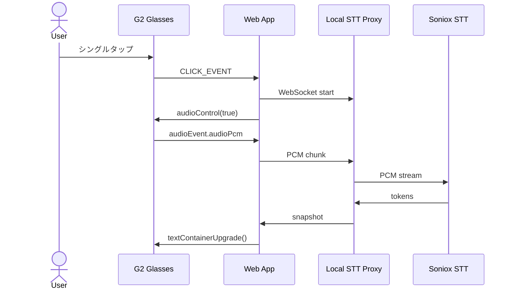

# ASR 音声認識デモ

Even Hub G2 のマイク音声を取得し、Soniox のリアルタイム STT API へ流して、認識結果をグラス上に表示する検証アプリです。

今回の検証では、単に音声認識を動かすだけでなく、G2 アプリとして実用的に見せるために以下の点を確認しました。

- `audioControl(true)` で G2 マイクの PCM 音声が `EvenHubEvent.audioEvent.audioPcm` として届くこと
- WebView からローカル WebSocket proxy 経由で Soniox に音声をストリーミングできること
- 認識中の interim text と確定済み final text を、グラスの小さい表示領域に破綻なく出せること
- Soniox が返す `<end>` 制御トークンは表示に混ぜず、認識された本文だけを出すこと
- 表示上限を超えた transcript は、文字の途中ではなく古い行ごと削除すること

## 動作イメージ

初期状態では、下部に操作状態だけが表示されます。


シングルタップで録音を開始すると、ステータスが録音中に変わり、認識結果が上部の transcript 領域へ流れます。


もう一度シングルタップすると録音を停止し、その時点までの確定テキストを残します。


## このサンプルでやっていること

画面は 3 つの `TextContainerProperty` で構成しています。

| コンテナ | 役割 |
|---|---|
| `eventLayer` | 全画面のイベント受け取り用。表示内容は空白 |
| `transcript` | 音声認識結果を表示する本文領域 |
| `status` | 接続中、録音中、停止、エラーなどの状態表示 |

G2 のディスプレイは `576 x 288` なので、本文領域を上部 `576 x 240`、ステータス領域を下部 `576 x 48` に分けています。

起動後の大まかな流れは次の通りです。

1. `waitForEvenAppBridge()` で SDK bridge の準備を待つ
2. `createStartUpPageContainer()` で 3 つの TextContainer を登録する
3. シングルタップで WebSocket proxy へ接続し、`audioControl(true)` でマイク入力を開始する
4. `audioEvent.audioPcm` の PCM データを proxy へ送る
5. proxy が Soniox へ音声を中継し、snapshot として `finalText` / `interimText` を返す
6. `textContainerUpgrade()` でグラス上の transcript と status を更新する



## セットアップ

Soniox の API key を `apps/asr/.env` に置きます。

```bash
SONIOX_API_KEY=your-key-here
```

ローカルでは、Vite アプリと STT proxy を別プロセスで起動します。

```bash
pnpm --filter @evenhub-playground/asr dev
pnpm --filter @evenhub-playground/asr dev:proxy
```

`app.json` では、ローカル proxy へ接続するために `network` 権限、G2 マイクを使うために `g2-microphone` 権限を指定しています。

```json
{
  "permissions": [
    {
      "name": "network",
      "whitelist": ["ws://localhost:3001", "ws://127.0.0.1:3001"]
    },
    {
      "name": "g2-microphone"
    }
  ]
}
```

## 実装メモ

### 1. WebView から直接 Soniox には接続しない

Soniox の API key をブラウザ側に持たせないため、このサンプルでは `proxy/server.mjs` を挟んでいます。

Web アプリ側はローカル proxy にだけ接続します。proxy は `.env` から `SONIOX_API_KEY` を読み込み、Soniox の `wss://stt-rt.soniox.com/transcribe-websocket` に接続します。

この構成にしておくと、G2 アプリ側の責務は「音声を送る」「認識結果を表示する」に絞れます。

### 2. 音声入力は `audioEvent.audioPcm` で届く

録音開始時に `bridge.audioControl(true)` を呼ぶと、以降の `onEvenHubEvent()` に `audioEvent.audioPcm` が含まれるようになります。

```typescript
const pcm = event.audioEvent?.audioPcm;
if (pcm && recording) {
  stt?.sendPcm(pcm);
}
```

アプリ停止時や録音キャンセル時は `audioControl(false)` を呼び、proxy との WebSocket も閉じます。これを入れないと、アプリ上は止まって見えてもマイクや WebSocket の状態が残りやすくなります。

### 3. interim と final を分けて表示する

Soniox から返る token には、確定済みの `is_final` と未確定の token があります。

proxy 側では確定済みを `finalText` に積み上げ、未確定を `interimText` として snapshot に含めます。Web アプリ側では、録音中は `finalText + interimText` をプレビューとして表示し、停止時に final text を transcript に確定します。

ブラウザ側のプレビュー UI では interim を薄い色で出しています。グラス側は単一のテキストコンテナなので、確定済みと未確定を結合して表示します。

### 4. `<end>` は表示しない

検証中、認識結果に `こんにちは<end>音声テストを<end>行ってます<end>` のような文字列が出ることがありました。

これは発話区切りを示す制御トークンで、ユーザーが発話した本文ではありません。そのため、proxy 側で token を連結する前に除外しています。

```javascript
const text = typeof token?.text === "string" ? token.text : "";
if (!text || text === "<end>") {
  continue;
}
```

さらに、Web アプリ側でも表示直前に `replaceAll("<end>", "")` を通しています。proxy の修正だけに依存しないようにしておくと、古い proxy や別の STT 実装から同じ形式の文字列が来ても表示が崩れません。

### 5. transcript は古い行から削除する

G2 の表示領域は小さいため、transcript は `MAX_TRANSCRIPT_CHARS = 240` に制限しています。

以前は末尾 240 文字を単純に切り出していましたが、この方式だと日本語の途中や行の途中から表示が始まることがあります。音声認識結果は発話ごとに改行して蓄積しているため、表示上限を超えた場合は古い行から削除する方式にしました。

```typescript
const lines = normalized.split("\n");
while (lines.length > 1 && lines.join("\n").length > MAX_TRANSCRIPT_CHARS) {
  lines.shift();
}
```

1 行だけで 240 文字を超える場合は、行単位で削れないため例外的に末尾 240 文字を残します。

## 動作確認で分かったこと

### G2 の表示は「ログ」より「現在読める文章」を優先した方がよい

ASR の transcript は長くなりやすいですが、G2 の表示領域は小さいです。文字単位で無理に詰めるより、古い発話単位で消していく方が読みやすくなりました。

特に日本語では、行や文の途中から表示が始まると内容を追いづらくなります。今回のサンプルでは、停止ごとに確定 transcript を 1 行として扱い、古い行から消す方針にしています。

### STT エンジンの token はそのまま UI に出さない

Soniox の `<end>` のように、STT エンジンが返す token には表示用ではない情報が混ざることがあります。

音声認識アプリでは「API が返した文字列をそのまま表示する」のではなく、UI に出す前に表示用テキストへ正規化する層を用意しておくのが重要でした。

### proxy は小さくても挟む価値がある

今回の proxy は、API key の秘匿、WebSocket の中継、token の正規化を担当しています。

G2 アプリ本体に外部 STT の仕様を詰め込むより、proxy に吸収させた方が、将来 STT エンジンを差し替える時の影響範囲を小さくできます。

## 操作方法

| 操作 | 挙動 |
|---|---|
| シングルタップ | 録音開始 / 録音停止 |
| ダブルタップ | アプリ終了確認 |
| システム終了イベント | マイク停止、WebSocket close、購読解除 |

`CLICK_EVENT(0)` は protobuf の都合で `eventType` が `undefined` として届くことがあるため、このサンプルでも `undefined` をクリック扱いにしています。この点は `event-debugger` アプリの検証結果と同じです。

## 参考コード

- [`src/main.ts`](./src/main.ts): G2 コンテナ作成、音声イベント処理、表示更新
- [`src/asr/stt.ts`](./src/asr/stt.ts): Web アプリ側の STT WebSocket client
- [`proxy/server.mjs`](./proxy/server.mjs): Soniox へ接続するローカル STT proxy
- [`app.json`](./app.json): network / microphone 権限設定
