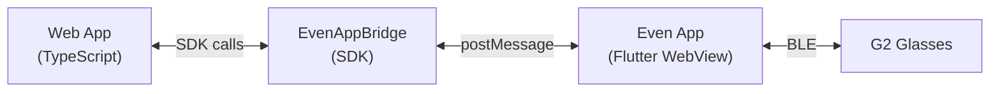
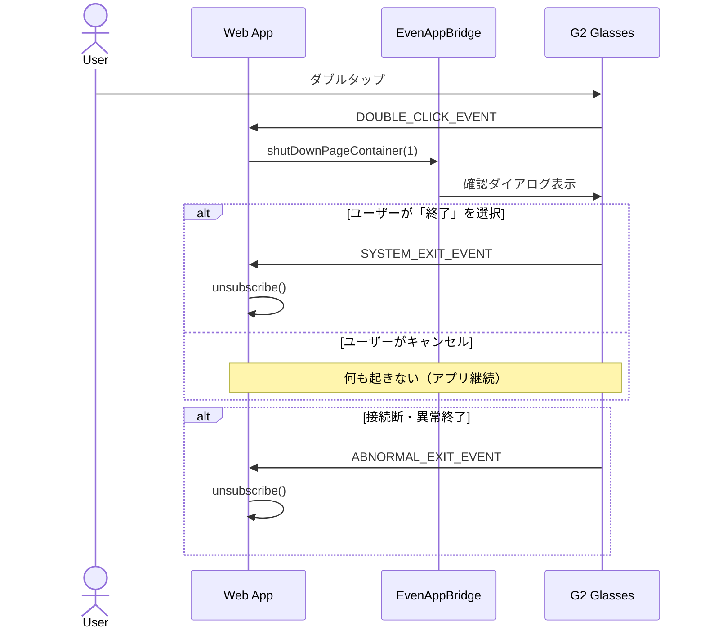
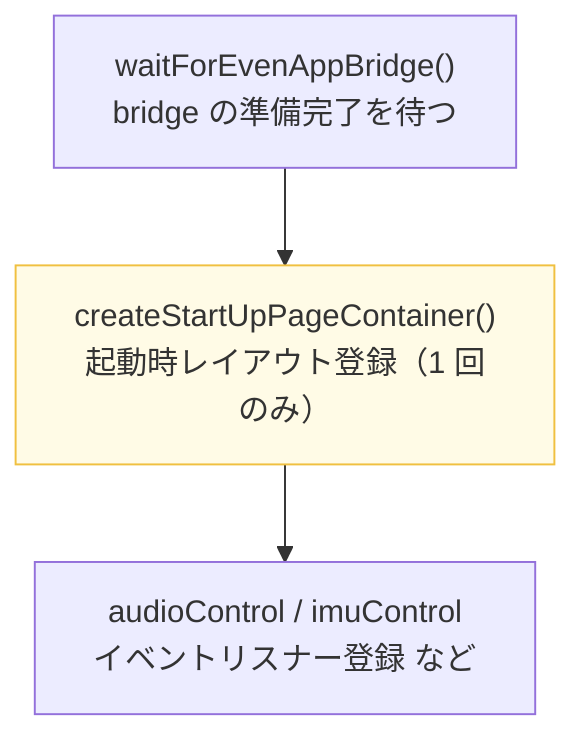

# 最小実装

Even Hub G2 アプリの最小構成を検証するプロジェクトです。

`createStartUpPageContainer` で単一の TextContainer を配置し、"Hello from G2!\nDouble-tap to exit." を表示します。
ダブルタップでアプリが終了します。


## 実装説明

### アーキテクチャ概要

Even Hub G2 アプリは、以下のアーキテクチャで動作します。



TypeScript で書いたコードは、Even Hub コンパニオンアプリ（Flutter 製）の中で動作する WebView 上で実行されます。通常のウェブアプリと同様に HTML + TypeScript で書けますが、UI の描画先はブラウザの DOM ではなく G2 グラスの液晶ディスプレイ になります。

> 参照：[公式ドキュメント — Architecture](https://hub.evenrealities.com/docs/getting-started/architecture)

---

### G2 ディスプレイ仕様

G2 のディスプレイには以下の制約があります。CSS・フレックスボックス・DOM は使えません。代わりに、SDK が提供するコンテナオブジェクトを絶対座標で配置することで UI を組み立てます。

| 仕様 | 値 |
|---|---|
| 解像度 | 576 × 288 px（片目）|
| カラー深度 | 4-bit グレースケール（16 段階）|
| 色の見え方 | 白ピクセルが明るい緑として表示される。黒は透過（オフ）|
| 背景色 | 指定不可 |
| UI モデル | CSS/DOM なし。絶対座標で配置するコンテナベース |

[`main.ts`](src/main.ts) の `width: 576, height: 288` という値は、この解像度に対してコンテナを画面全体に広げる指定です。

---

### Step 1 — 初期化：`waitForEvenAppBridge()`

```typescript
const bridge = await waitForEvenAppBridge();
```

SDK の起点となる `EvenAppBridge` インスタンスを取得します。Even Hub アプリ側の native bridge が準備完了するまで非同期で待機するため、トップレベル `await` で呼び出すのが公式推奨パターンです。

同期版の `EvenAppBridge.getInstance()` も存在しますが、bridge の初期化が完了した後でしか正しく動作しません。初期化直後に使う場合は `waitForEvenAppBridge()` 一択です。

> 参照：[公式ドキュメント — Getting Started](https://hub.evenrealities.com/docs/getting-started/overview)

---

### Step 2 — コンテナ定義：`TextContainerProperty`

G2 の画面上に配置する UI 要素を コンテナ と呼びます。コンテナには 3 種類あります。

| 種類 | クラス名 | 役割 |
|---|---|---|
| テキスト | `TextContainerProperty` | 文字列を表示する |
| リスト | `ListContainerProperty` | 選択式のスクロールリストを表示する |
| 画像 | `ImageContainerProperty` | 画像の表示枠（後から `updateImageRawData` で画像を注入）|

1 ページあたりの上限

| 対象 | 上限 |
|---|---|
| コンテナ総数 | 12 個 |
| テキスト・リストコンテナ | 8 個 |
| 画像コンテナ | 4 個 |

このサンプルでは最もシンプルなテキストコンテナを 1 つだけ配置しています。

```typescript
const mainText = new TextContainerProperty({
  xPosition: 0,     // 画面左端
  yPosition: 0,     // 画面上端
  width: 576,       // 画面全幅（G2 キャンバス横幅）
  height: 288,      // 画面全高（G2 キャンバス縦幅）
  borderWidth: 1,   // 枠線の太さ（0 で非表示）
  borderColor: 5,   // 枠線色（0〜15 のグレースケール番号）
  paddingLength: 4, // 内側余白（px）
  containerID: 1,   // ページ内ユニークな整数 ID
  containerName: "main",                          // ページ内ユニークな名前（最大 16 文字）
  content: "Hello from G2!\nDouble-tap to exit.", // 表示テキスト（最大 1,000 文字、\n で改行）
  isEventCapture: 1, // 1 にしたコンテナがタッチ入力を受け取る（ページに必ず 1 つだけ）
});
```

各プロパティの詳細

| プロパティ | 範囲 | 説明 |
|---|---|---|
| `xPosition` / `yPosition` | 0〜576 / 0〜288 | コンテナ左上の座標。原点は画面左上 `(0, 0)` |
| `width` / `height` | 0〜576 / 0〜288 | コンテナのサイズ（px）|
| `borderWidth` | 0〜5 | 枠線の太さ。`0` で非表示 |
| `borderColor` | 0〜15 | グレースケール色番号。`0` が黒、`15` が白 |
| `paddingLength` | 0〜32 | 内側余白（px）|
| `containerID` | 任意整数 | ページ内一意の ID。`textContainerUpgrade()` 等で使用 |
| `containerName` | 文字列（最大 16 文字）| ページ内一意の名前 |
| `content` | 最大 1,000 文字 | 初期表示テキスト。`\n` で改行 |
| `isEventCapture` | `0` または `1` | `1` のコンテナがユーザー入力を受け付ける。**ページに必ず 1 つ**設定すること |

---

### Step 3 — 起動レイアウト登録：`createStartUpPageContainer()`

```typescript
const result = await bridge.createStartUpPageContainer(
  new CreateStartUpPageContainer({
    containerTotalNum: 1,      // このページに配置するコンテナの総数
    textObject: [mainText],    // テキストコンテナの配列
  }),
);

console.log("Page created:", result === 0 ? "success" : `failed (${result})`);
```

`createStartUpPageContainer()` は起動時に 1 回だけ 呼ぶ API で、ページ上のすべてのコンテナをまとめて登録します。

> この API は 2 回以上呼んでも無視されます。起動後のレイアウト全体更新には `rebuildPageContainer()` を使います。

戻り値は `StartUpPageCreateResult` の数値コードです。

| コード | 意味 |
|---|---|
| `0` — `success` | 正常に登録完了 |
| `1` — `invalid` | コンテナ設定が不正 |
| `2` — `oversize` | 総コンテナサイズが上限超過 |
| `3` — `outOfMemory` | デバイスのメモリ不足 |

---

### Step 4 — イベントハンドリング：`onEvenHubEvent()`

```typescript
const unsubscribe = bridge.onEvenHubEvent((event) => {
  // protobuf の都合で eventType = 0 (CLICK_EVENT) は undefined になりうるため ?? null で受ける
  const sysType  = event.sysEvent?.eventType  ?? null;
  const textType = event.textEvent?.eventType ?? null;
  // ...
});
```

`onEvenHubEvent()` はすべてのイベントを一元的に受け取るコールバックです。イベントの種類は `event` オブジェクトのフィールドで判別します。

| フィールド | 型 | 発火タイミング |
|---|---|---|
| `event.textEvent` | `Text_ItemEvent` | テキストコンテナへのユーザー操作 |
| `event.listEvent` | `List_ItemEvent` | リストの選択・スクロール |
| `event.sysEvent` | `Sys_ItemEvent` | システムライフサイクルイベント |
| `event.audioEvent` | `{ audioPcm: Uint8Array }` | マイク音声の PCM データ |

> 参照：[公式ドキュメント — Input Events](https://hub.evenrealities.com/docs/guides/input-events)

`OsEventTypeList` — イベント種別一覧

```typescript
enum OsEventTypeList {
  CLICK_EVENT            = 0,  // シングルタップ
  SCROLL_TOP_EVENT       = 1,  // 上スクロール
  SCROLL_BOTTOM_EVENT    = 2,  // 下スクロール
  DOUBLE_CLICK_EVENT     = 3,  // ダブルタップ
  FOREGROUND_ENTER_EVENT = 4,  // フォアグラウンド復帰
  FOREGROUND_EXIT_EVENT  = 5,  // バックグラウンド移行
  ABNORMAL_EXIT_EVENT    = 6,  // 異常終了（接続断など）
  SYSTEM_EXIT_EVENT      = 7,  // 正常終了（ユーザー確定後）
  IMU_DATA_REPORT        = 8,  // IMU センサーデータ
}
```

このサンプルで使用するイベントは 3 種類です。

| イベント | 用途 |
|---|---|
| `DOUBLE_CLICK_EVENT (3)` | ダブルタップによる終了要求を検知 |
| `SYSTEM_EXIT_EVENT (7)` | 確認ダイアログで「終了」が確定した後に発火 |
| `ABNORMAL_EXIT_EVENT (6)` | 接続断などの強制終了時に発火 |

---

### Step 5 — アプリ終了フロー



```typescript
// ① ダブルタップ → 確認ダイアログを表示
if (
  sysType  === OsEventTypeList.DOUBLE_CLICK_EVENT ||
  textType === OsEventTypeList.DOUBLE_CLICK_EVENT
) {
  bridge.shutDownPageContainer(1); // exitMode 1 = 確認ダイアログあり
  return;
}

// ② 退出確定 or 異常終了 → リスナー解除（リソース後始末）
if (
  sysType === OsEventTypeList.SYSTEM_EXIT_EVENT ||
  sysType === OsEventTypeList.ABNORMAL_EXIT_EVENT
) {
  unsubscribe();
}
```

`shutDownPageContainer()` の `exitMode` には 2 つの選択肢があります。

| `exitMode` | 挙動 |
|---|---|
| `0` | 確認なしで即時終了 |
| `1` | 確認ダイアログを表示（ユーザーがキャンセル可能）|

ダブルタップ後、ユーザーが確認ダイアログで「はい」を選ぶと `SYSTEM_EXIT_EVENT` が発火します。この時点でリスナーを解除します。

---

### 呼び出し順序の重要性

公式ドキュメントで定められた必須の呼び出し順序があります。これを守らないと `audioControl` や `imuControl` などの API が正常に動作しません。



---

### プロジェクト構成

```
apps/minimal/
├── app.json          # Even Hub へ提出するアプリのメタデータ
├── index.html        # WebView のエントリーポイント
├── package.json      # 依存関係と開発スクリプト
├── tsconfig.json     # TypeScript 設定
├── vite.config.ts    # Vite ビルド設定
└── src/
    └── main.ts       # アプリのすべてのロジック
```

`app.json` には Even Hub への提出時に必要なメタデータを記述します。

```json
{
  "package_id": "evenhub.playground.minimal",
  "edition": "202601",
  "name": "Even Hub Playground Minimal",
  "version": "0.1.0",
  "min_app_version": "2.0.0",
  "min_sdk_version": "0.0.10",
  "entrypoint": "index.html",
  "permissions": [],
  "supported_languages": ["ja", "en"]
}
```

---

### 開発コマンド

```bash
# 開発サーバーを起動
pnpm dev

# シミュレーターで動作確認（実機不要）
pnpm simulator

# 型チェック
pnpm typecheck

# プロダクションビルド
pnpm build

# Even Hub パッケージ（.ehpk）を生成
pnpm pack
```

シミュレーターは `http://localhost:5173` に接続し、G2 グラスの表示をデスクトップ上で再現します。実機を持っていなくても動作確認が可能です。

---

### 参考資料

**公式ドキュメント**

- [Even Hub — Overview](https://hub.evenrealities.com/docs/getting-started/overview)
- [Even Hub — Architecture](https://hub.evenrealities.com/docs/getting-started/architecture)
- [Even Hub — Input Events](https://hub.evenrealities.com/docs/guides/input-events)
- [Even Hub — Device APIs](https://hub.evenrealities.com/docs/guides/device-apis)
- [Even Hub — Installation](https://hub.evenrealities.com/docs/getting-started/installation)

**コミュニティ**

- [Zenn — EvenG2でアプリを作ってみる Part1（セットアップ編）](https://zenn.dev/miyaura/articles/eveng2-part1-getstarted-0ed90d3aa144e8)
- [Zenn — EvenG2でアプリを作ってみる Part2（実装編）](https://zenn.dev/miyaura/articles/eveng2-part2-intructions-44c14f04b8fa08)
- [Zenn — EvenG2でアプリを作ってみる Part3（ビルド・公開編）](https://zenn.dev/miyaura/articles/eveng2-part3-buildandpublish-73cbfca6c2851b)
- [Zenn — Claude Code で Even G2 グラスアプリを作る](https://zenn.dev/wmoto_ai/articles/claude-code-even-g2-glasses)
- [even-g2-notes（GitHub）](https://github.com/nickustinov/even-g2-notes) — アーキテクチャ詳解・SDK の挙動・サンプル実装集
